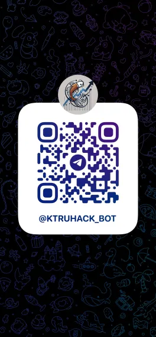
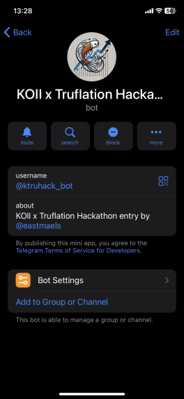

## KOII x Truflation Hackathon Tasks

This task aims to integrate different components with KOII nodes. 
This is just one part of the system.

Other parts are:
1. Task
    - This repository 
2. [Backend API](https://github.com/blurtopian/truhack_api)
    - retrieves all data 
    - submits tweets to a backend API for analysis
3. [A Telegram Mini App](https://github.com/blurtopian/truhack_tgapp)
    - accessible thru @ktruhack_bot

| QR | Intro |
| -- | -- |
|  |  |

Run the test with 
```
yarn install or npm install
yarn test or npm run test
```